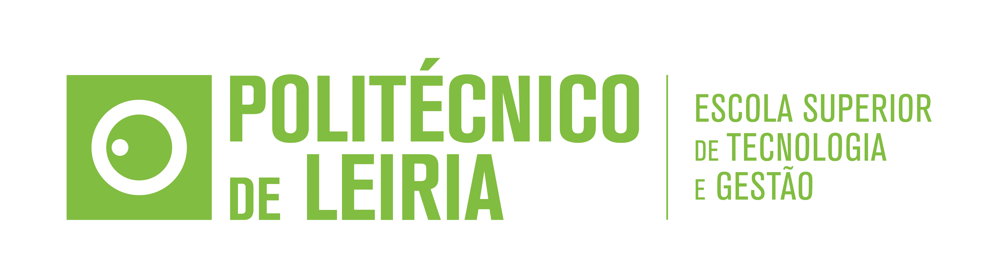

# Projeto Metodologias de Desenvolvimento de Software

### Membros do grupo:
* Rafael Rodrigues n.º2231691
* Rafael Santos n.º2231701
* Henrique Neves n.º2231680

### Como é o projeto:
Este projeto é direcionado ao uso numa cantina de uma escola, em que se trata de um sistema de software de gestão própria que terá as funcionalidades de gerir os menus e as reservas da cantina. Onde é possível gerir os menus dos dias de uma determinada semana, controlar as reservas, carregar o saldo dos clientes e efetuar a faturação das reservas. 

### Requisitos para utilização do projeto:
Será necessário instalar o [Visual Studio 2022](https://visualstudio.microsoft.com/vs/) com os pacotes gerais ****SQL Server Data Tools**** e ****Entity Framework 6 Tools****.\
Depois de tranferir o projeto, com o Visual Studio deve escolher para selecionar uma pasta existente, onde selecionará a pasta do código do projeto.\
No relatório do projeto encontrará um manual de utilização a explicar como utilizar o projeto.
